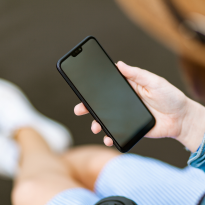
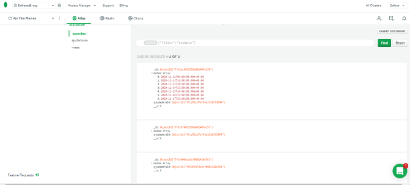

# API FALA, MAMÃE!   
👩    👶  

### PROJETO FINAL {REPROGRAMA}
		
Esse é um projeto final do curso da {Reprograma} em parceria com a XP Investimentos.
É um CRUD (Create, Read, Update e Delete) onde temos três Schemas (opções) de fazer o crud, que são: Mães, Ajudadoras e Agenda (que dependem da ajudadora).

### Objetivo: 🎯 
Uma rede de escuta e acolhimento às mães, que usualmente são sobrecarregadas com cuidados da casa, crianças e trabalho.
Um lugar onde possam desabafar e buscar orientação, sobre as constantes cobranças em conseguir dar conta de tudo. 
A ideia surgiu de depoimentos de mamães que se sentem sozinhas, não tendo um adulto para conversar ao final do dia.

### Aprendizados:   🏫 
Além de todo o conteúdo do bootcamp: lógica de programação, github, construção de Api baseado na estrutura MVC, deploy. Solidifiquei experiências de cooperação e ajuda. 

Instruções para utilização: 👇 
 > Localmente

Clonar o repositório na sua máquina.

Intalar as dependências mencionadas.

NPM Start

 > Remotamente

 Usar o link do Heroku

GET - https://app-mamae.herokuapp.com/agenda

### Tecnologias utilizadas: 📌 	

     
     

### Rotas dos Schemas(mae, ajudadora, agenda) :

### Parte dos Modelos : 

### Exemplo de Collections no Atlas Mongo Db :
 

## Agradecimentos :  🙏 

A Deus. Ao meu filho e marido pela paciência e parceria. A Reprograma pela oportunidade. As professoras e monitoras pelo conhecimento compartilhado. E a turma, vocês são mulheres maravilhosamente incríveis. Adorei fazer parte dessa história!

